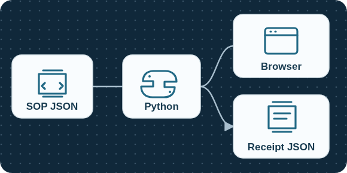
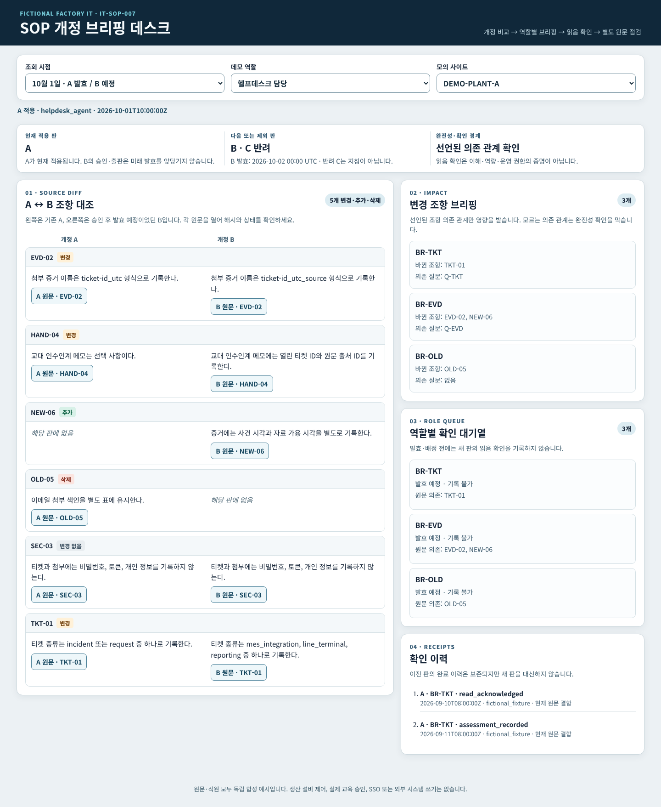
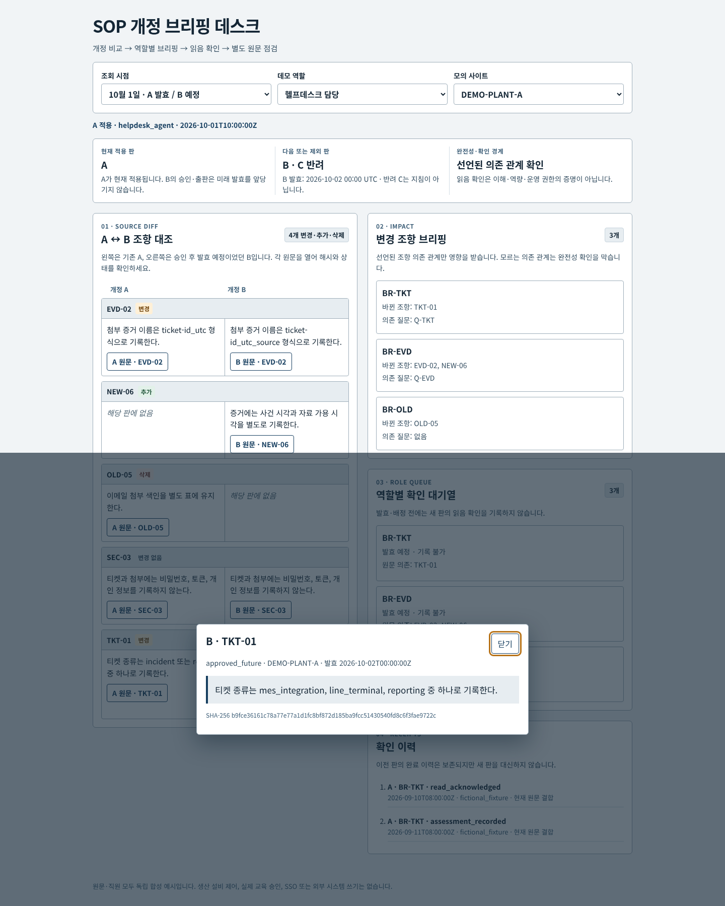
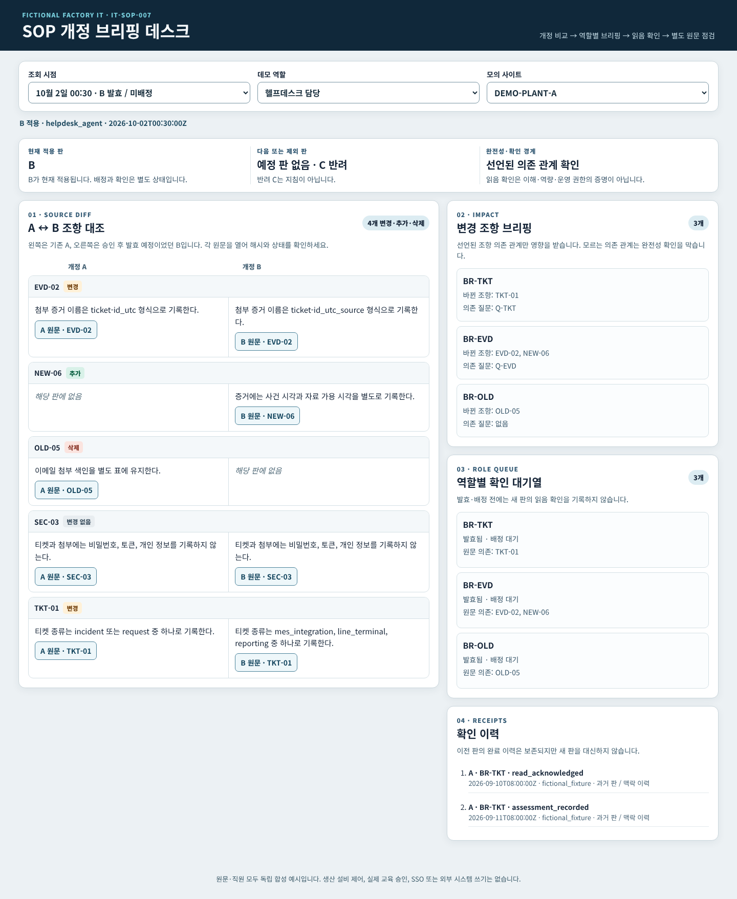
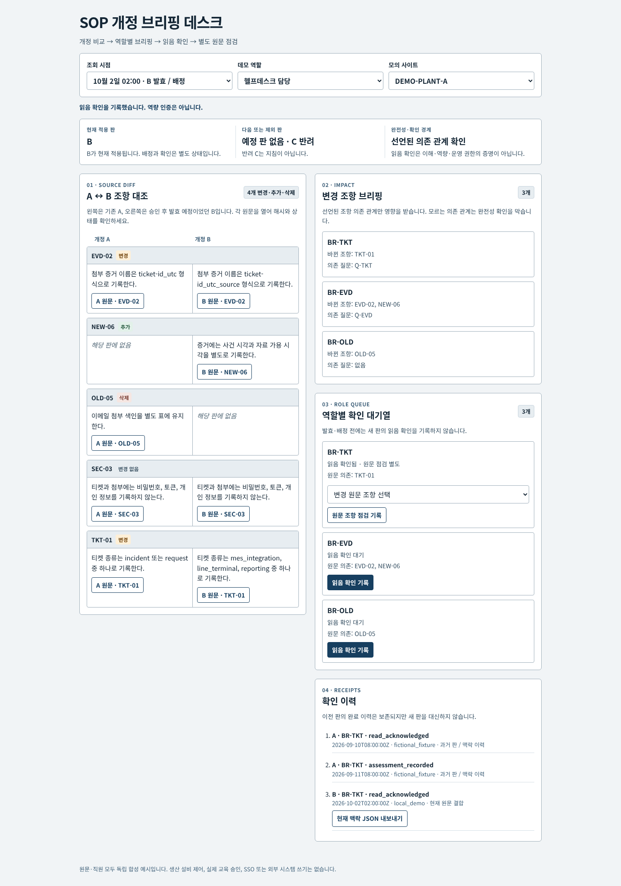
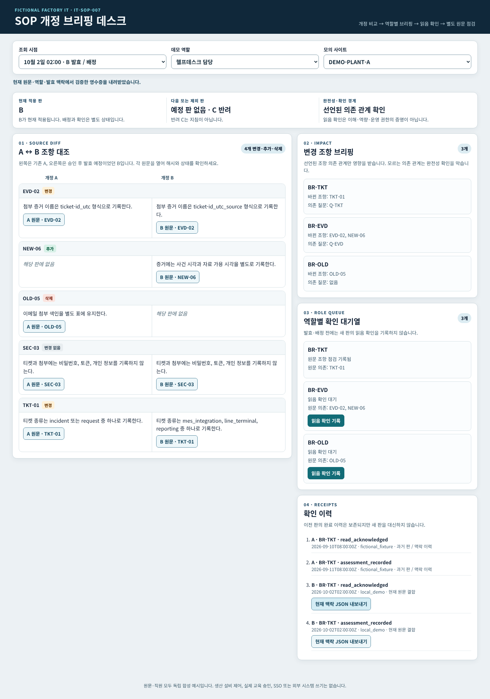
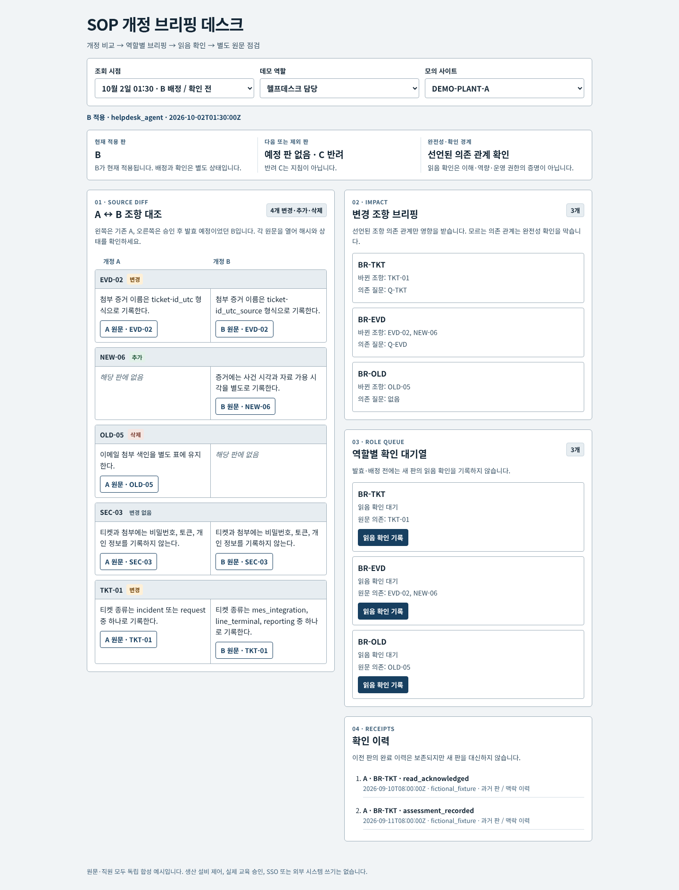
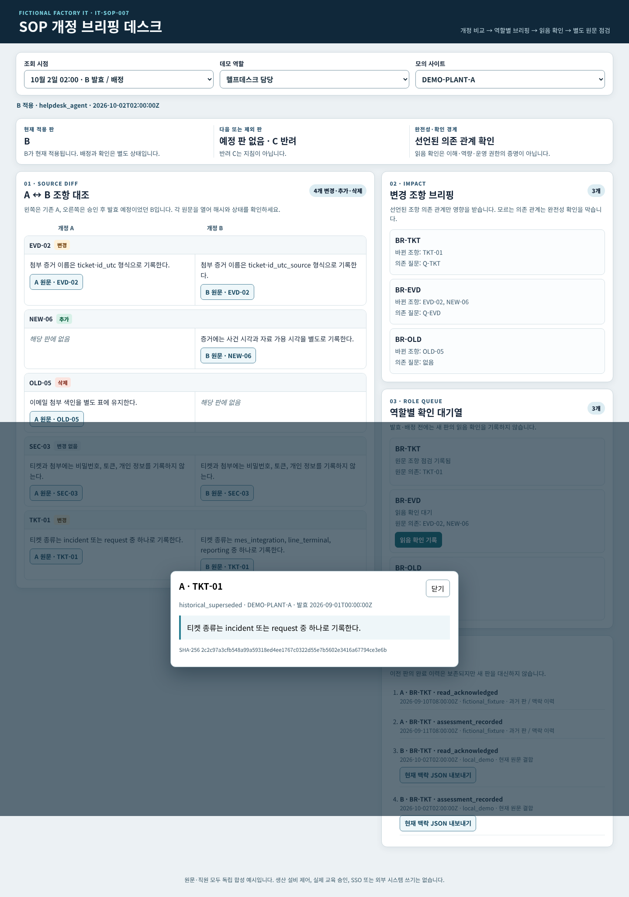
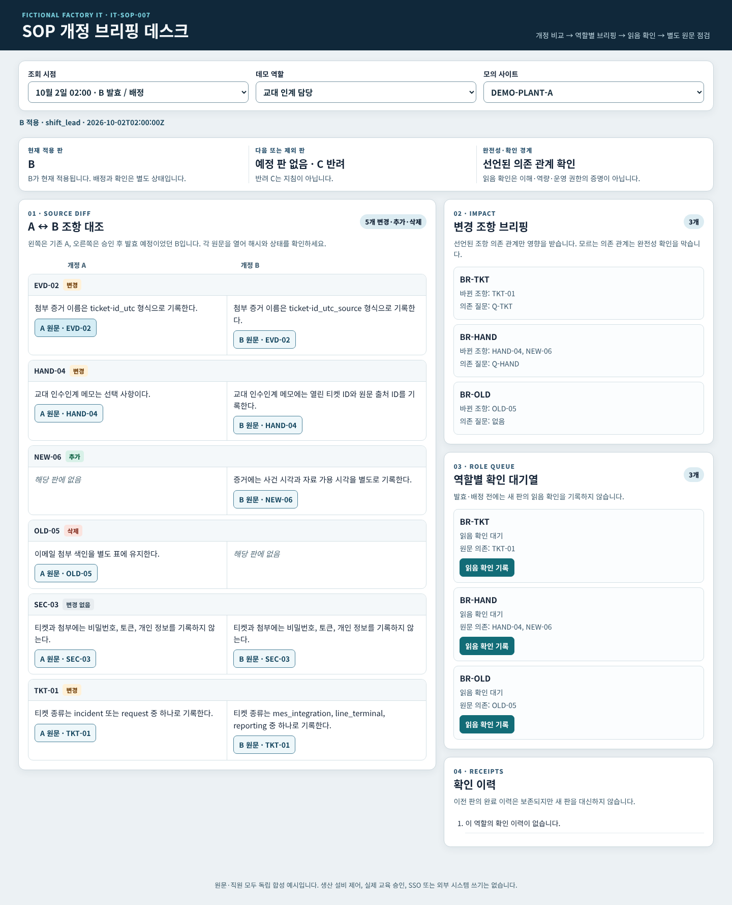
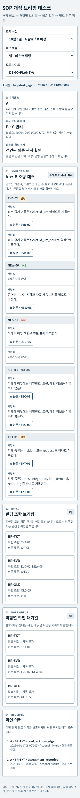

# 모의 공장 IT SOP 개정 브리핑 데스크

[편집 가능한 SVG](assets/architecture.svg) · [그림 출처](assets/PROVENANCE.md). 그림은 현재 구현된 CPU 경로입니다. Ollama·외부 교육 시스템·실제 설비 연동은 없습니다.

> **범위:** 독립 작성한 무해한 가상 공장 IT 헬프데스크 문서 한 건의 개정 비교, 역할별 변경 브리핑, 읽음 확인과 별도 원문 조항 점검을 시연합니다. 직원 정보나 실제 공장 자료는 없습니다. 읽음 확인과 이 화면의 점검은 이해·역량·현장 권한을 증명하지 않습니다.

## 업무 장면

헬프데스크 담당자는 오늘 적용 중인 **A판**과 승인됐지만 내일 발효하는 **B판**을 나란히 봅니다. 티켓 분류, 증거 이름, 교대 인계, 자료 가용 시각 조항의 변경·추가·삭제를 원문 ID와 해시로 확인합니다. 교대 인계 담당자는 자신에게 연결된 브리핑만 보고, 과거 A판의 확인 이력을 유지한 채 B판을 새로 확인합니다.

반려된 **C판**은 지침이 아닙니다. B판의 내용 승인, 발행, 발효, 역할 배정, 읽음 확인, 원문 조항 점검은 서로 다른 상태입니다. 2026-10-02 00:30 UTC에는 B가 발효했어도 01:00 배정 전이므로 읽음 확인을 기록할 수 없습니다.

## 기업 사례에서 참고한 범위

| 공개 출처가 말하는 업무 | 이 프로젝트가 독립적으로 만든 것 | 주장하지 않는 것 |
|---|---|---|
| [Dozuki의 Blue Buffalo 고객 사례](https://www.dozuki.com/customers/blue-buffalo)는 공급자 설명으로 현장 자료를 디지털 작업 지침에 반영하고 교육 접근을 개선한 사례를 소개합니다. | 가상의 IT SOP A/B 조항 대조와 발효 시점 표시 | 고객의 비공개 시스템 설계, 이 프로젝트의 교육 효과 |
| [Poka의 USG 고객 사례](https://www.poka.io/en/customers-stories/usg-faster-digital-work-instructions-using-industrial-ai/)는 공급자 설명으로 작업 지침의 AI 작성·변환 사용을 소개합니다. | 역할별 변경 브리핑과 출처 확인 대기열 | 사례의 수치 성과 재현, 우리 앱의 AI 작성 성능 |
| [Dozuki AI 제품 페이지](https://www.dozuki.com/ai)는 ChangeAware와 개정 설명을 제품 기능으로 소개합니다. | 조항 ID에 연결한 개정 브리핑 흐름의 **제안적 응용** | 이 전체 생애주기를 이름 붙은 고객이 배포했다는 주장 |

세 링크는 공급자 공개 자료이며 수치나 문구를 데이터 또는 코드로 복사하지 않았습니다. 원문과 UI는 별도 작성한 합성 예시입니다. 자료 확인일은 2026-09-30 UTC이고, 고객 성과는 독립 검증 결과로 다루지 않습니다.

## 실제 작동 방식

1. 합성 manifest의 SHA-256으로 A/B/C판, 이벤트, 의존 관계 원문을 검증합니다. Git 체크아웃에서도 LF 바이트가 유지되도록 .gitattributes를 고정했습니다.
2. 승인·발행 이벤트와 발효 시각을 따로 계산합니다. B가 미래 발효인 동안 A가 현재 지침이며 C는 반려 초안으로만 남습니다.
3. CPU가 안정된 조항 ID의 문장을 문자 그대로 비교합니다. A→B에서 변경 3건, 삭제 1건, 추가 1건, 동일 1건입니다. 선택한 역할이 읽을 수 있는 조항만 대조·원문 API에 나오며, 선언된 조항→브리핑→질문 매핑만 영향받습니다. 매핑이 빠지면 완전성 주장과 확인 동작을 막습니다.
4. 사이트·데모 역할·조회 시각을 서버에서 검사합니다. 허용되지 않은 사이트의 원문, 비교, 대기열은 클라이언트로 보내지 않습니다. 역할 선택은 데모 입력이며 SSO가 아닙니다.
5. 현재 판이 발효되고 해당 역할에 배정된 경우에만 읽음 확인을 로컬 메모리에 기록합니다. 원문 조항 선택 점검은 별도 영수증입니다. 영수증은 판·원문 해시·매핑 해시/버전·사이트·역할·발효 시각에 결합됩니다. 동일 요청 ID는 동일 내용일 때만 멱등으로 처리합니다.
6. 이전 판 영수증은 이력에 남지만 B의 새 확인이 되지 않습니다. JSON 내보내기는 현재 원문·역할·배정·발효 맥락을 다시 검사합니다. 서버 재시작 시 시연 중 만든 영수증은 사라집니다.

[고정 원문·상태 계약](docs/contract.md), [시험 기록](docs/test-manifest.md), [모델 사용 전 고정 제안 계약](docs/model-protocol.md)을 분리했습니다. 시험 기대 파일은 시험 코드만 읽으며 브라우저와 런타임 검색에 제공되지 않습니다.

## 실행

Python 3.10+ 표준 라이브러리만 필요합니다.

    python3 -m sop_desk.server --port 19113

같은 컴퓨터에서 http://127.0.0.1:19113/ 을 엽니다. 서버는 127.0.0.1에만 바인드됩니다. 실사용 인증 수단이나 교육 기록 저장소가 아닙니다.

    python3 -m unittest discover -s tests -q
    node --check static/app.js

선택적인 로컬 Qwen 전처리 재현에는 기존 Ollama qwen3:4b와 requirements-model.txt의 CPU tokenizer가 필요합니다. 이 의존성은 기본 CPU 화면·계약 테스트에는 필요하지 않습니다. 실패한 개발 요청을 재실행하지 마세요.

실제 화면 검사는 설치된 Playwright와 Chrome, 시스템 ffmpeg가 있는 환경에서 `python3 tests/browser_demo.py`로 수행했습니다. 이 브라우저 검사는 CI의 필수 게이트에 포함되지 않습니다.

## 실제 화면과 검증

**34개 CPU 계약 테스트**와 JavaScript 구문 검사, 실제 Chrome 시나리오가 통과했습니다. 이는 이 작은 합성 입력에 대한 엔지니어링 검사 수이며 AI 정확도나 교육 효과의 점수가 아닙니다. 브라우저에서는 키보드 원문 열기/닫기·포커스 복귀, 발효 전·배정 전 확인 차단, 미래 영수증의 과거 상태 유입 차단, 이전 판의 역사 상태, 읽음/원문 조항 점검 분리, 영수증 내보내기, 오래 걸린 응답 뒤 맥락 변경, 거부 사이트 화면 비움, 390px 가로 넘침 없음을 확인했습니다.

| 실제 캡처 | 보이는 상태 |
|---|---|
|  | A 적용, B 예정, 조항 대조 |
|  | B 원문·해시·미래 발효 표시; 열린 모달의 닫기 버튼 초점 |
|  | 발효와 역할 배정 사이에는 확인 동작 차단 |
|  | A 이력과 B의 새 읽음 확인 분리 |
|  | 별도 원문 조항 점검 영수증과 현 맥락 JSON 내보내기 |
|  | 나중 영수증이 01:30 상태·이력·점검 가능 여부에 반영되지 않음 |
|  | B 발효 뒤 A 원문을 대체된 역사 판으로 명시 |
|  | 역할별 조항 의존 관계와 제외된 원문 |
|  | 좁은 화면에서 조항별 세로 비교, 가로 넘침 없음 |

[실제 Chrome 조작 영상](artifacts/demo/workflow.mp4)과 캡처는 합성 UI를 자동 조작해 얻은 원본 화면입니다. UI 성공처럼 보이도록 프레임을 합성하지 않았습니다. [캡처 출처·SHA-256](artifacts/demo/PROVENANCE.md)에 새 화면과 이전 화면을 구분했습니다.

## 모델 상태와 한계

[v1.1 HTTP 500 CPU 진단](docs/model-http500-diagnosis.md)은 설치 버전의 정규식 스키마 변환 제약을 유력 원인으로 좁혔지만, 당시 오류 본문이 없어 단일 원인으로 확정하지 않습니다. [v1.2 고정 계약·실측](docs/model-run-v1.2.md)은 별도 실행기로 합성 개발 요청 **1건**을 보낸 결과입니다. JSON·한글 형식은 4/4행 통과했지만 조항 ID 오복사로 전체 초안이 거절됐습니다. 원문 기반 요약 검토에서는 2/4행만 완전 지지, 1행은 사실 오류, 1행은 변경값 누락입니다. 정식·독립 모델 평가는 아직 없습니다.

**v1.1 고정 개발 사례의 실제 모델 요청 1건은 HTTP 500으로 실패했습니다. 재시도하지 않았고 생성된 요약은 없습니다.** [실측 전처리·실패 기록](docs/model-run-v1.1.md)에 입력 580토큰, 4096 문맥, 출력 상한 768, 요청 1.701초 및 원시 오류 본문 미보존 한계를 기록했습니다. 정식 모델 평가는 0건입니다. CPU 기준선은 literal diff와 선언된 의존 관계를 처리합니다. 향후 기존 로컬 Qwen을 사용할 경우에도 모델은 허용된 변경 조항에 대한 **출처가 있는 요약 초안**만 제안할 수 있습니다. 승인, 발효, 배정, 읽음 확인, 질문 점검 결과는 모델이 결정하지 않습니다. 실패한 개발 요청으로 AI 요약 구현 또는 품질 성능을 주장하지 않습니다.

문자열이 같다는 것은 업무 의미가 같다는 증명이 아닙니다. 누락된 의존 관계는 자동으로 “영향 없음”이 되지 않습니다. 합성 판 A/B/C와 고정 기대 상태는 독립 벤치마크나 실제 직원 이해도 자료가 아닙니다. 영수증 저장소는 프로세스 메모리, 사용자 선택은 데모 역할이며 외부 공개 서비스용 보안·SSO·전자서명이 없습니다. 물리 안전 지시, 실제 설비 제어, 외부 시스템 쓰기는 구현하지 않았습니다.

코드는 [MIT](LICENSE), 직접 작성한 합성 예시는 같은 저장소에 공개됩니다. 외부 업체의 기사·상표·제품 화면은 이 라이선스에 포함되지 않습니다.
